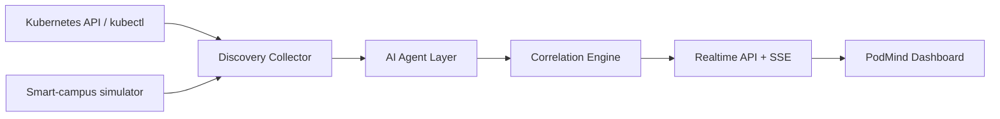

# PodMind

AI agents for realtime pod resource discovery, anomaly detection, dependency mapping, and industrial edge optimization in single-node Kubernetes environments.

PodMind is shaped as an ABB Accelerator style project across Data and AI, Advanced Automation, Operational Technology, IoT, Application Monitoring, Cloud Infrastructure, and Sustainability. It runs as a lightweight Python service with a browser dashboard. It can read live cluster pod data through the in-cluster Kubernetes API or local `kubectl`, then falls back to a realtime smart-campus simulator when a cluster is not available.

## What is included

- Realtime dashboard with pod table, resource charts, dependency graph, anomaly timeline, and NLP insight panel.
- **NLP Chat Interface** — ask PodMind natural language questions about pods, anomalies, dependencies, and forecasts.
- **Resource Heatmap** — namespace × metric heat grid for instant infrastructure visibility.
- **Dark mode** — toggle between light and dark themes with glassmorphism panel design.
- Multi-agent backend: CPU, Memory, Storage/PVC, Network, Log/IO, Dependency, **RCA (Root Cause Analysis)**, and Recommendation agents.
- **Multi-horizon forecasting** — 5/15/30/60 minute predictions with restart probability and storage exhaustion ETA.
- **Success Metrics** panel showing operational KPI targets (MTTR, detection accuracy, forecast precision).
- Kubernetes deployment with readonly RBAC and NodePort service.
- Demo smart-campus workloads for Minikube, K3s, MicroK8s, or similar single-node clusters.
- Technical report in [docs/technical-report.md](docs/technical-report.md).
- ABB/recruiter brief in [docs/abb-accelerator-brief.md](docs/abb-accelerator-brief.md).

## Required capabilities covered

- Realtime resource discovery: CPU, RAM, disk, PVC read/write, network RX/TX, logs, restarts, and latency.
- Multi-agent AI analysis: CPU, Memory, Storage/PVC, Network, Log/IO, Dependency, RCA, and Recommendation agents.
- Interdependency mapping: service graph with relation type, strength, latency, and evidence.
- Intelligent recommendations: alert queue, optimization actions, forecast horizon, and confidence.
- Conversational AI: natural language queries for pod diagnostics, dependency lookups, forecasts, and recommendations.
- Rich dashboard: charts, resource heatmap, resource matrix, topology, correlations, anomaly timeline, NLP chat, dark mode, and success metrics.

## Deployment Options

PodMind supports three deployment modes:

| Mode | What you need | Data source |
| --- | --- | --- |
| **Option 1: Local Python** | Python 3.10+ | Simulated smart-campus pods |
| **Option 2: Docker** | Docker Desktop | Simulated smart-campus pods |
| **Option 3: Kubernetes (Minikube)** | Docker Desktop + Minikube | Real Kubernetes API (live pods) |

---

### Option 1 — Run locally with Python (fastest)

```powershell
# Start PodMind with simulated data
python .\backend\podmind.py --mode mock --port 8765
```

Open [http://127.0.0.1:8765](http://127.0.0.1:8765) in your browser.

Use the scenario buttons on the dashboard to simulate anomalies:
- CPU spike, PVC stress, Memory leak, Network fan-out, Restart loop

---

### Option 2 — Run with Docker

```powershell
# Step 1: Build the Docker image
docker build -t podmind:latest .

# Step 2: Run the container
docker run -p 8765:8765 podmind:latest
```

Open [http://127.0.0.1:8765](http://127.0.0.1:8765) in your browser.

To run with live Kubernetes data from Docker Desktop:

```powershell
docker run -p 8765:8765 -e PODMIND_MODE=auto -v %USERPROFILE%\.kube\config:/root/.kube/config podmind:latest
```

---

### Option 3 — Deploy to Kubernetes (Minikube)

This is the full production-style deployment with real pod discovery.

```powershell
# Step 1: Install Minikube (if not installed)
winget install Kubernetes.minikube

# Step 2: Start a Minikube cluster
minikube start --driver=docker --memory=2048 --cpus=2

# Step 3: Build the Docker image inside Minikube's Docker daemon
minikube docker-env --shell powershell | Invoke-Expression
docker build -t podmind:latest .

# Step 4: Deploy demo smart-campus workloads
kubectl apply -f .\demo\university-workloads.yaml

# Step 5: Deploy PodMind (creates namespace, RBAC, deployment, service)
kubectl apply -f .\deploy\podmind.yaml

# Step 6: Wait for PodMind pod to be ready
kubectl wait --for=condition=ready pod -l app=podmind -n podmind --timeout=90s

# Step 7: Forward the port to your browser
kubectl port-forward svc/podmind 8765:8765 -n podmind
```

Open [http://127.0.0.1:8765](http://127.0.0.1:8765) in your browser.

The dashboard will show **Mode: kubernetes-api-live** and discover all real pods across namespaces.

To stop:

```powershell
# Stop port-forward: press Ctrl+C
# Delete everything:
kubectl delete -f .\deploy\podmind.yaml
kubectl delete -f .\demo\university-workloads.yaml
minikube stop
```

---

### Optional: Enable metrics-server for live CPU/memory

```powershell
minikube addons enable metrics-server
```

## Architecture



## API

- `GET /health` returns service health.
- `GET /api/snapshot` returns one complete resource and insight snapshot.
- `GET /api/stream` streams snapshots as server-sent events.
- `POST /api/scenario` changes the simulator scenario.
- `POST /api/nlp` accepts a natural language query and returns AI-generated answers.
- `POST /api/alerts/config` configures alert channels (stub for production integration).

Example:

```powershell
Invoke-RestMethod -Method Post http://127.0.0.1:8765/api/scenario `
  -ContentType "application/json" `
  -Body '{"scenario":"pvc_stress"}'
```

## Project layout

```text
backend/                 Python realtime engine and API
frontend/                Dashboard HTML, CSS, and JavaScript
deploy/podmind.yaml      Kubernetes RBAC, deployment, and service
demo/                    Smart-campus demo workloads
docs/                    Technical report
scripts/                 Local and Minikube helper scripts
```

## Notes

The prototype intentionally avoids third-party Python and frontend dependencies so it can run quickly in constrained lab environments. For production, the next step would be swapping the simulated secondary signals for Prometheus, kube-state-metrics, Loki, PVC metrics, and eBPF network flow data.
