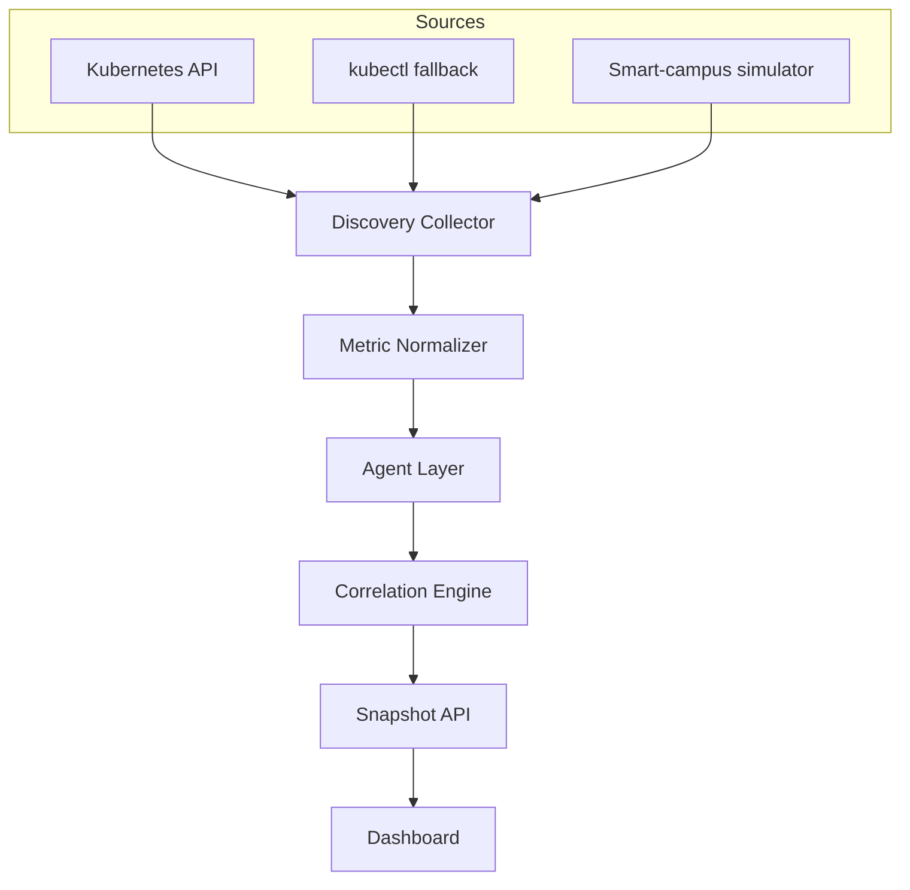

# Technical Report: PodMind

## 1. Overview

PodMind is a container-native observability and intelligence prototype for single-node Kubernetes environments such as Minikube, K3s, and MicroK8s. The system focuses on resource discovery and dependency interpretation rather than raw metric display alone.

The prototype demonstrates a smart-campus environment with services for student portal, attendance, library upload, document storage, transport, and notifications. It detects resource pressure, maps service relationships, and generates operational recommendations.

The project is also positioned for ABB Accelerator focus areas: Data and Artificial Intelligence, Application and Business Process Monitoring, Advanced Automation, Operational Technology, IoT, Cloud Infrastructure, Digital Workplace, ERP extension, and Sustainability.

## 2. Goals

- Discover pod resource behavior across namespaces.
- Analyze CPU, memory, storage/PVC, network, and log/IO signals.
- Build an interdependency graph between services.
- Detect anomalies such as CPU bursts, PVC pressure, memory growth, network fan-out, and restart loops.
- Present realtime insights through an interactive dashboard.
- Provide recruiter-ready evidence of deployment readiness, focus-area alignment, alerting, forecasting, and sustainability impact.

## 3. System Architecture

## 4. Data Pipeline

The collector runs in `auto` mode by default.

1. Inside Kubernetes, it reads pods and pod metrics through the service account token and the Kubernetes API.
2. Outside Kubernetes, it attempts `kubectl get pods -A -o json` and `kubectl top pods -A`.
3. If cluster access is unavailable, it uses a realtime simulator with the same data shape.

Each pod is normalized into:

- CPU millicores and CPU limit percentage
- Memory MiB and memory limit percentage
- Disk usage estimate
- PVC read/write rate
- Network receive/transmit rate
- Restart count
- Log line rate
- Latency estimate
- Risk level and anomaly labels

## 5. Agent Methodology

PodMind uses specialized analysis agents. Each agent receives the same pod snapshot, dependency graph, and recent history.

| Agent | Focus | Example signal |
| --- | --- | --- |
| CPU Agent | CPU bursts and throttling | CPU above 80 percent of limit |
| Memory Agent | Leaks and OOM risk | Memory above 78 percent or rising slope |
| Storage/PVC Agent | Disk and PVC pressure | Write rate above 8 MiB/s |
| Network Agent | Service fan-out | Transmit rate above 450 KiB/s |
| Log/IO Agent | Restarts and noisy logs | CrashLoopBackOff or high log rate |
| Dependency Agent | Impact relationships | High latency on downstream service |
| RCA Agent | Root cause correlation | Multi-signal causal chain hypothesis |
| Recommendation Agent | Optimization action | Scaling, throttling, profiling, or PVC isolation |

The implementation is rule-assisted and deterministic for demo reliability. In a production version, these agents can be replaced or extended with statistical models, learned baselines, and LLM-based summarization.

## 6. Dependency Mapping

The prototype builds service edges from known smart-campus relationships and namespace-local correlation when running against arbitrary pod sets. Each edge contains:

- Source service
- Target service
- Relationship type such as HTTP, PVC, queue, DNS, scrape, or logs
- Strength score
- Latency estimate
- Evidence string

When an anomaly appears on either side of an edge, the dependency score is raised. This lets the dashboard highlight likely cause-effect paths, such as upload pressure on a PVC increasing latency in document storage.

## 7. Anomaly Detection

Anomalies are assigned from threshold and trend checks:

- CPU risk when usage exceeds 80 percent of limit
- Memory risk when usage exceeds 78 percent of limit
- Storage risk when PVC write rate or disk usage is high
- Network risk when transmit rate indicates fan-out
- Restart risk when containers restart repeatedly or leave Running state
- Log/IO risk when log volume is high

Risk is classified as:

- `normal` for stable pods
- `warning` for one or more active risk signals
- `critical` for combined restart, CPU, or storage risks

## 8. Dashboard

The dashboard includes:

- Cluster status strip
- Scenario controls
- Resource KPI tiles
- ABB focus-area rail
- Realtime resource chart
- Service dependency graph
- Agent findings
- Pod resource table
- All-namespace resource discovery matrix
- Anomaly timeline
- Recommendations and correlation summaries
- Alert queue, forecast panel, sustainability panel, capability coverage, and readiness gates
- NLP Chat Interface for natural language cluster queries
- Resource heatmap (namespace × metric grid)
- Dark mode with glassmorphism panel design
- Success Metrics panel with operational KPI targets

## 8.2 NLP Query Engine

The NLP Chat Interface accepts natural language questions and returns structured answers by pattern-matching against known query types:

- Pod restart analysis
- Top resource consumers (CPU, memory)
- Dependency graph lookups
- Anomaly summaries
- Forecasting queries
- Optimization recommendations
- Cluster health overviews

The engine operates entirely offline with zero external dependencies. Production deployments can extend this with LLM-based summarization.

## 8.3 Multi-Horizon Forecasting

The forecast engine generates predictions at 5, 15, 30, and 60-minute horizons:

- CPU/Memory/PVC trend extrapolation
- Restart probability estimation
- Storage exhaustion ETA calculation

Snapshots are streamed using server-sent events at a two-second cadence, with polling as a fallback.

## 8.1 ABB Focus-Area Mapping

| Focus area | Implementation evidence |
| --- | --- |
| Data and Artificial Intelligence | Multi-agent analysis and NLP insight generation |
| Digital Workplace | Operator dashboard with readable alerts and recommendations |
| Application and Business Process Monitoring | Namespace-wide pod monitoring and anomaly timeline |
| Advanced Automation | Automated alert and action queue |
| Operational Technology | Single-node edge cluster deployment pattern |
| Internet of Things | Network fan-out and PVC stress scenarios |
| Application and Development | Dockerfile, Kubernetes manifests, API, demo workloads, docs |
| Cloud, Hosting, and Infrastructure | RBAC, service account, health checks, NodePort, port-forward |
| Enterprise Resource Planning | Structured alert payloads ready for ITSM or ERP adapters |
| Sustainability | Right-sizing and estimated energy-waste signals |

## 9. Deployment

The project can run in three modes:

- Local mock mode for demos without Kubernetes
- Local auto mode with `kubectl`
- In-cluster mode using the Kubernetes API and readonly RBAC

The Kubernetes deployment is defined in `deploy/podmind.yaml`. Demo smart-campus workloads are in `demo/university-workloads.yaml`.

## 10. Demo Plan

1. Start PodMind locally or deploy it to Minikube.
2. Open the dashboard.
3. Trigger `CPU spike` and observe the CPU agent and dependency graph.
4. Trigger `PVC stress` and observe storage correlation between library upload and document storage.
5. Trigger `Memory leak` and observe memory risk and forecast changes.
6. Trigger `Network fan-out` and observe network agent findings.
7. Trigger `Restart loop` and observe log/IO agent findings and anomaly timeline.

## 11. Future Work

- Replace estimates with Prometheus, kube-state-metrics, cAdvisor, and Loki data.
- Add eBPF or Cilium Hubble for real network flow discovery.
- Add persistent time-series storage with TimescaleDB or Prometheus remote read.
- Add learned baselines per pod and namespace.
- Add LLM-assisted incident reports and remediation playbooks.
- Export alerts to Slack, email, PagerDuty, or Kubernetes Events.
